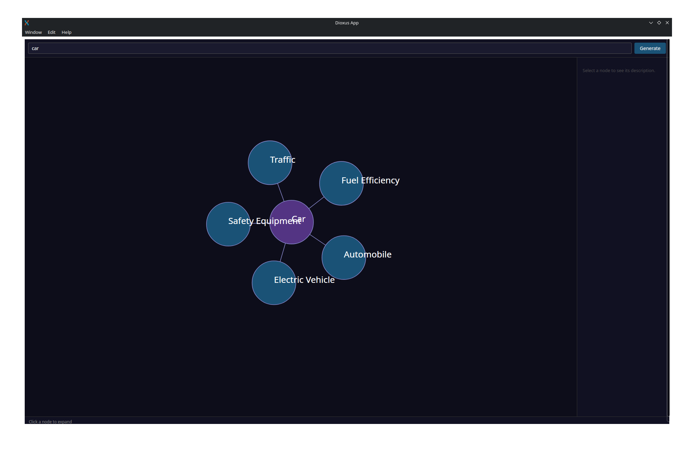
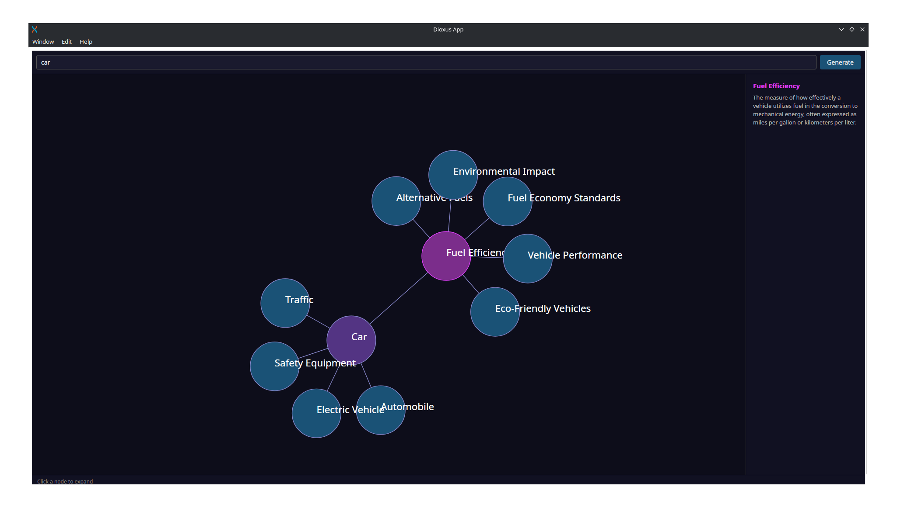

Look at the project on Github: [Mind map](https://github.com/KlemenKobau/mind-map).

This week I was toying around with ollama.
I wanted to create a project that helps you explore topics and find other relevant things.
In a previous post *[using a Local LLM with Ollama and rust](/posts/local-llm-ollama-rust/)*
I tried setting up my local LLM api.
This time I was trying what the LLM can actually do.

I wanted the LLM to be able to access the internet, this is very easy with tools.
Make sure that the model can use tools and you should be ready to go ([Models that can use tools](https://ollama.com/search?c=tools)).

Adding tools to the model in ollama_rs is simple.
The following snippet is all of the important logic.

```rs
// Step 1: Research the topic using web search and scraping tools
let mut coordinator = Coordinator::new(Ollama::default(), 
                            "qwen2.5:7b".to_string(), vec![])
    .add_tool(DDGSearcher::new()) // adding tools
    .add_tool(Scraper::new());

let research = coordinator
    .chat(vec![ChatMessage::user(format!(
        "Search for information about '{topic}'. Summarize: what it is, \
            a brief 1-2 sentence description, and 3-5 closely related concepts."
    ))])
    .await?;

let research_text = &research.message.content;

// Step 2: Convert the research into structured NodeData
let b = Box::new(JsonStructure::new::<NodeData>());
let format = FormatType::StructuredJson(b);
let prompt = format!(
    "Based on this research:\n{research_text}\n\n\
        Generate a mind-map entry for '{topic}'. \
        Provide: name, short description (1-2 sentences), 
        and 3-5 closely related concept names."
);
let res = Ollama::default()
    .generate(
        GenerationRequest::new("qwen2.5:7b".to_string(), prompt)
            .format(format)
            .think(false),
    )
    .await?;
Ok(serde_json::from_str(&res.response)?)
```

First the researcher searches the internet for information.
We add the search tools with `.add_tool`.

Next, we give this content to the "structurer", who
returns a json representation of the data.
We have to use this two part step, because the researcher doesn't
return structured json.

There is a lot more logic to display the data in a structured graph,
but we can use dioxus and fdg-sim for graph simulations,
this part was much faster by using Claude code.

If we search for *car*, then
the result is the following graph:


We can click and leaf node and it will expand further:


This project was a lot of fun, but I see that my
GPU is way too slow for any more interesting processing.